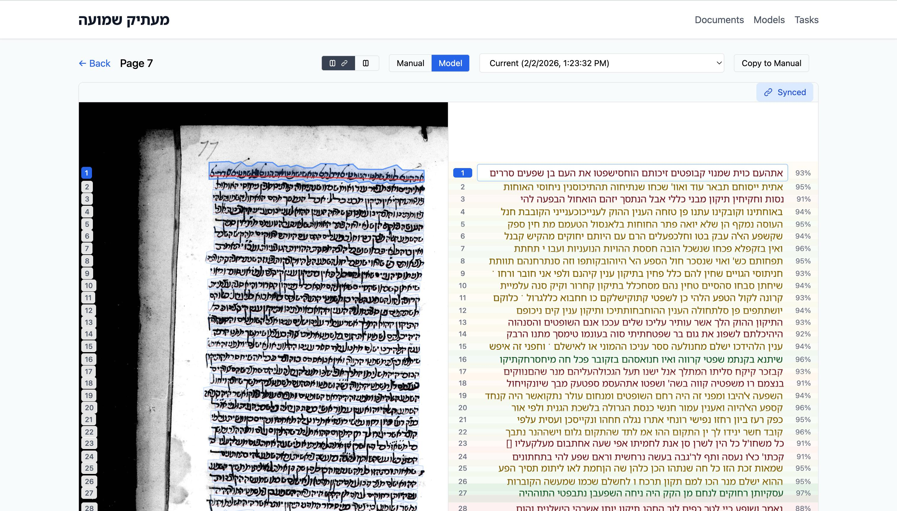

 


### 📝 **Maatik Shemua**
> *Hebrew*:
> מעתיק שמועה
> *Meaning:* Literally 'transmitter(s) of the oral word', _maatikei ha-shemu'a_ is an ancient description of the Rabbis of old. Focused on transmission of tradition as well, this project aims to transmit their heritage from handwriting to text. 


A HTR (Handwritten Text Recognition) tool designed for easy Hebrew manuscript transcription. When complete, it will featuring full RTL support (using Kraken's engine), paleographic markup conventions, and version history. Inspired by eScriptorium.




## Features

- Support for PDF, TIFF, PNG, and JPEG images
- Automatic line detection (using Kraken's baseline segmentation or custom)
- Side-by-side image and transcription view with visual line alignment
- Full right-to-left text support for Hebrew manuscripts
- Support for markup conventions in Jewish Studies and adjacent fields:
  - `[...]` - Lacuna (i.e. illegible text)
  - `⟨...⟩` - Editorial addition
  - `{...}` - Scribal deletion
  - `?` - Uncertain reading
- OCR using Kraken recognition models
- Automatic versioning with deduplication
- Export Formats: TEI-XML, Alto XML, PAGE XML, and plain text
- Fine-tuning allows for training custom models using your transcriptions
- Full IIIF manifest support
- WCAG 2.1 AA compliant with keyboard navigation (in development!)

## Quick Start

### Using Docker Compose

1. Clone the repository:
```bash
git clone https://github.com/yourusername/MaatikShemua.git
cd MaatikShemua
```

2. Create data directories:
```bash
mkdir -p data models logs
```

3. Start the application:
```bash
# Full version, using with Redis/Celery for async tasks
docker-compose up -d

# Or lightweight version
docker-compose -f docker-compose.light.yml up -d
```

4. Open http://localhost:3000 in your browser

### Development Setup

#### Backend

```bash
cd backend
python -m venv venv
source venv/bin/activate
pip install -r requirements.txt
uvicorn app.main:app --reload
```

##### Backend testing (Python 3.14-friendly)

For running the backend test suite without heavy OCR/HTR dependencies:

```bash
cd backend
source venv/bin/activate
pip install -r requirements.txt
pytest
```

This uses only the core backend and testing dependencies. Because of Kraken's limitations, we use Python 3.14.

If you want to run kraken-based pipelines locally, use a Python version supported by kraken (for example 3.11) or a container, and install the optional extras:

```bash
cd backend
python -m venv venv-kraken
source venv-kraken/bin/activate
pip install -r requirements.txt
pip install -r requirements-kraken.txt
```

Kraken isn't required for running tests. Note to contributors: future kraken-dependent tests should be marked to skip automatically when kraken is unavailable.

#### Frontend

```bash
cd frontend
npm install
npm run dev
```

## Config

Environment variables for the backend include:

| Variable | Description | Default |
|----------|-------------|---------|
| `DATABASE_URL` | SQLite database path | `sqlite:///./data/maatik.db` |
| `REDIS_URL` | Redis connection URL | `redis://localhost:6379/0` |
| `AUTH_ENABLED` | Enable HTTP Basic Auth | `false` |
| `AUTH_USERNAME` | Auth username | `admin` |
| `AUTH_PASSWORD` | Auth password | - |
| `LOG_LEVEL` | Logging level | `INFO` |
| `LOG_FORMAT` | Log format (`json` or `console`) | `json` |
| `ALLOWED_MODEL_DIRS` | Comma-separated allowed model paths | `/app/models` |
| `USE_BACKGROUND_TASKS` | When `true`, long-running jobs (fine-tuning, inference) run in Celery workers; when `false`, they run in-process in a thread | `true` |

### Background tasks (using Redis/Celery)

If `USE_BACKGROUND_TASKS` is `true`, ensure that Redis must be running and at least one Celery worker must be started so that fine-tuning and inference jobs are executed.

**Fine-tuning** run on a dedicated queue `finetune` so only one job runs at a time (this avoids memory contention). Start a worker that consumes only this queue with concurrency 1:

  ```bash
  cd backend
  source venv/bin/activate  # or venv-kraken if using Kraken
  celery -A app.tasks worker -Q finetune --concurrency=1 --loglevel=info
  ```

**Inference** use the default queue; it is possible to run a separate worker for the default queue (e.g. `celery -A app.tasks worker --loglevel=info`) such that inference can run in parallel while fine-tuning is serialized.

Docker Compose is the easiest way to streamline the entire process. the full stack (backend, frontend, Redis, and a Celery worker for the finetune queue) is started by `docker compose up`.

## Adding Models

Running Kraken's inference models on images requires two types of models:

1. **Segmentation Model**: For line detection
2. **Recognition Model**: For OCR/HTR

Place model files in the `models/` directory and add them through the Models page in the UI, or use the API:

```bash
curl -X POST http://localhost:8000/api/models \
  -H "Content-Type: application/json" \
  -d '{
    "name": "Hebrew HTR Model",
    "path": "/app/models/hebrew_htr.mlmodel",
    "type": "recognition",
    "description": "Hebrew manuscript recognition model"
  }'
```

## Keyboard Shortcuts

| Shortcut | Action |
|----------|--------|
| `Ctrl+S` | Force save |
| `Ctrl+←/→` | Previous/next page |
| `Ctrl+↑/↓` | Previous/next line |
| `Ctrl+L` | Insert lacuna `[...]` |
| `Ctrl+A` | Insert addition `⟨...⟩` |
| `Ctrl+D` | Insert deletion `{...}` |
| `Ctrl+U` | Insert uncertain `?` |
| `Ctrl+M` | Toggle manual/model view |
| `Escape` | Back to index |

## API Documentation

Visit http://localhost:8000/docs for the interactive API documentation.

## Architecture
React frontend (with OpenSeaDragon for image viewing), FastAPI backend, SQLAlchemy models, Pydantic schemas, and WebSocket handlers (for carrying Celery messages)
Redis and Celery for async support, Kraken for HTR engine, and Docker for containerization.

## Export Formats

### TEI-XML

Note that exports use paleographic conventions converted to TEI elements:
- `[text]` → `<unclear>` or `<gap/>`
- `⟨text⟩` → `<supplied>`
- `{text}` → `<del>`

### Alto XML

Standard Alto 4.0 format. Optional word confidence values.

### PAGE XML

PAGE format. Goal is to be compatible with Transkribus and other tools.

### Plain Text

Simple text export with optional page headers and line numbers. Uses UTF-8 with BOM for Hebrew text compatibility.

## License

MIT License

## Acknowledgments

- [Kraken](https://github.com/mittagessen/kraken) - HTR engine
- [OpenSeadragon](https://openseadragon.github.io/) - Image viewer
